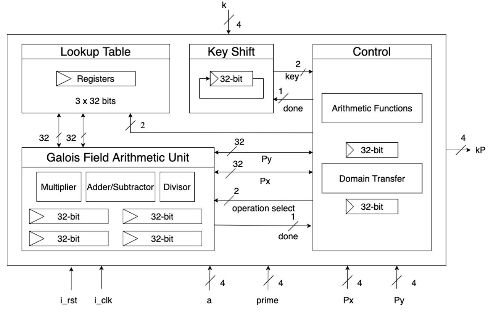

# Elliptic Curve Cryptography with lookup table

## Introduction

In IC design, a great deal of research focus on the accelerator of cryptographic algorithm. In the related field, ECC (Elliptic Curve Cryptography) is relatively popular, due to its smaller key size with better security. ECC can operate under both binary field and prime field, and each field leads to different hardware design, leading to the diversity of ECC-related research.

## Feature

In the proposed design, we utilized the lookup table to optimize the whole design. With the lookup table, we can reduce the number of point addition by storing coordinate value of P, 2P, 3P in the lookup table. Compared with traditional double and add algorithm, we can double twice and add once per iteration, and the key shifter will shift two bits per iteration.

For the two bits read from key shifter with the value 01, 10, and 11, we utilize the point P, 2P, and 3P, which are stored in lookup table, to execute the point addition. For the two bits read from key shifter with the value 00, we can just execute point double without point addition. As a result, the design can reduce the total execution time, in the expense of the slight increase on overall area.

## Design Architecture

## Authors

[@YiWenLai510](https://github.com/YiWenLai510)
[@reggiehsu111](https://github.com/reggiehsu111)

## Reference

Jen-Wei Lee, Yao-Lin Chen, Chih-Yeh Tseng, Hsie-Chia Chang, and Chen-Yi Lee, “A 521-bit Dual-Field Elliptic Curve Cryptographic Processor with Power”, Sept. 2010

